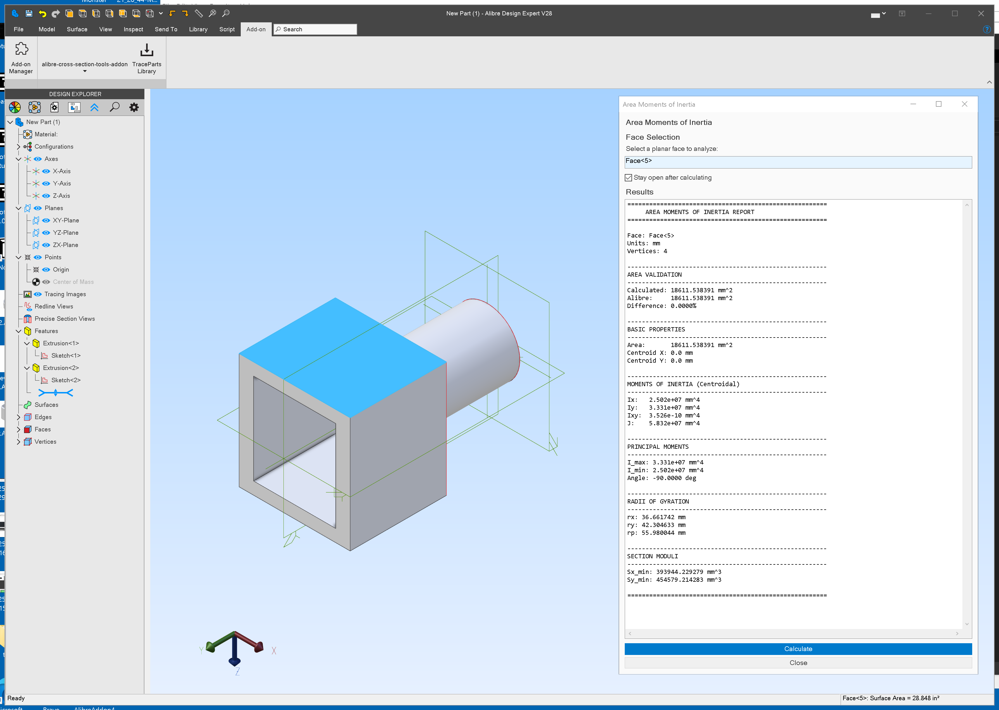
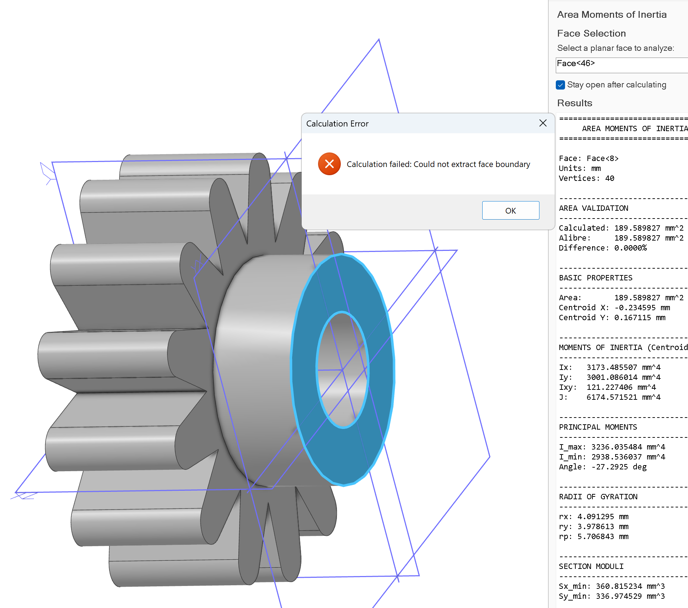

# Alibre Cross-Section Tools Add-On

An Alibre Design add-on that computes section properties for a selected planar face of a part.

Select a planar face, click Calculate, and read back area, centroid, moments of inertia, principal moments, radii of gyration, and section moduli. The add-on is a VB.NET assembly that implements the Alibre `IAlibreAddOn` interface and hosts an IronPython 2.7.10 engine. The single menu command runs an IronPython script (`Template.py`) that draws a Windows Forms dialog, reads the selected face through the AlibreScript API, and runs shoelace polygon math on the projected 2D boundary. It targets Alibre Design 29.0.0.29060 and builds against .NET Framework 4.8.1 (x64).

## Table Of Contents

- [What Is Here](#what-is-here)
- [Official Alibre Resources](#official-alibre-resources)
- [Requirements](#requirements)
- [Quick Start](#quick-start)
- [Installation](#installation)
- [Usage](#usage)
- [Key Files](#key-files)
- [Key Folders](#key-folders)
- [Screenshots](#screenshots)
- [Notes](#notes)
- [License](#license)

## What Is Here

- A VB.NET add-on (`AlibreAddOn.vb`) that registers one menu command and hosts IronPython to run the analysis script.
- An IronPython analysis script (`Template.py`) that computes cross-section properties for a selected planar face and presents them in a Windows Forms dialog.
- Computed values: area, centroid, centroidal moments of inertia (Ix, Iy, Ixy, J), principal moments (I_max, I_min) and the principal-axis angle, radii of gyration (rx, ry, rp), and minimum section moduli (Sx_min, Sy_min).
- Area validation that compares the computed area against Alibre's reported face area and shows the percentage difference.
- Results reported in the current document's units (mm, cm, m, in, or ft).
- An Inno Setup installer script and the Alibre add-on manifest (`.adc`).
- A development reference script with analytical geometry types, plus dated code-review notes under `reviews/`.

## Official Alibre Resources

Alibre's official resources for API development and AI/LLM/agent workflows: <https://www.alibre.com/api/>

## Requirements

- Alibre Design 29.0.0.29060 with the AlibreScript add-on installed (the script imports `AlibreScript.API` and loads assemblies from Alibre's `Addons\AlibreScript` folder).
- .NET Framework 4.8.1, x64 (`PlatformTarget` is x64 for both Debug and Release).
- IronPython 2.7.10, referenced through NuGet and copied into the add-on output.
- .NET SDK build tooling for the SDK-style VB.NET project (`UseWPF` and `UseWindowsForms` are enabled).
- Build references resolve from `C:\Program Files\Alibre Design 29.0.0.29060\Program` (`AlibreAddOn.dll`, `AlibreX.dll`, and `AlibreScriptAddOn.dll`).

## Quick Start

1. Open `source/alibre-cross-section-tools-addon.vbproj` and build the Release configuration.
2. Register the build output with Alibre Design (see [Installation](#installation)).
3. Start Alibre Design, open a part, and run the **alibre-cross-section-tools-addon** command from the Add-on menu.

## Installation

Install with the provided Inno Setup script (`source/alibre-cross-section-tools-addon.iss`). It deploys the add-on to `Program Files\Alibre Design Add-Ons\alibre-cross-section-tools-addon`, writes a string value under `HKLM\SOFTWARE\Alibre Design Add-Ons` naming the install folder, and requires administrator privileges.

To install manually, copy the contents of `source/bin/Release/net481` (the add-on DLL, the `.adc` manifest, the IronPython assemblies, and the `scripts` folder) to a folder, then add a string value under the `HKLM\SOFTWARE\Alibre Design Add-Ons` registry key whose name is the add-on name and whose data is that folder path. The `.adc` manifest loads the DLL at startup and defines the add-on's menu and Identifier GUID.

## Usage

1. Open a part in Alibre Design.
2. Run the **alibre-cross-section-tools-addon** command from the Add-on menu to open the Area Moments of Inertia dialog.
3. Click the face-selection box, then pick a planar face in the model.
4. Click **Calculate** to display the section-properties report.
5. Enable **Stay open after calculating** to analyze more faces without reopening the dialog.

## Key Files

| File | Purpose |
| --- | --- |
| `source/AlibreAddOn.vb` | VB.NET add-on entry point; implements `IAlibreAddOn`, registers one menu command, hosts an IronPython engine, and runs `alibre_setup.py` then `Template.py`. |
| `source/scripts/Template.py` | Section-properties analysis and Windows Forms dialog; extracts the face boundary, projects it to 2D, and runs the shoelace polygon math. |
| `source/scripts/alibre_setup.py` | IronPython bootstrap that references `AlibreX` and `AlibreScriptAddOn` and resolves the current part or assembly from the session. |
| `source/scripts/adding-more-geometry-types.py` | Development reference with analytical geometry types (for example a circular cross-section) cited by comments in `Template.py`. |
| `source/alibre-cross-section-tools-addon.vbproj` | SDK-style VB.NET project targeting `net481` at x64; references Alibre assemblies and IronPython 2.7.10. |
| `source/alibre-cross-section-tools-addon.adc` | Alibre add-on manifest: friendly name, startup DLL load, menu text, and Identifier GUID. |
| `source/alibre-cross-section-tools-addon.iss` | Inno Setup installer script that deploys and registers the add-on. |
| `source/logo.png` | Add-on logo image. |
| `LICENSE` | License text. |
| `.gitignore` | Ignore rules for build output and editor noise. |

## Key Folders

| Folder | Purpose |
| --- | --- |
| `source/` | VB.NET add-on project, IronPython scripts, manifest, and installer. |
| `source/scripts/` | IronPython scripts the add-on runs at invoke time. |
| `source/bin/Release/net481/` | Build output used for installation (add-on DLL, `.adc`, IronPython assemblies, and `scripts`). |
| `documentation/` | Screenshots of the add-on in use. |
| `reviews/` | Dated code-review notes (`2026-06-15-code-review.md`, `2026-06-20-code-review.md`). |
| `submodules/` | Placeholder for submodules; currently holds only `.gitkeep`. |

## Screenshots

The add-on running in Alibre Design with the Area Moments of Inertia report:

A curved face raising "Calculation failed: Could not extract face boundary", the curved-boundary limitation in practice:

Additional screenshots: `../documentation/B.png` and `../documentation/SNAG-0014.png`.

## Notes

- Curved edges (arcs and circles) are approximated as straight chords. The AlibreScript edge API used here exposes vertices but no method to sample points along a curve, so curved faces can fail boundary extraction or return limited accuracy.
- The unordered face-vertex fallback sorts points by angle about their centroid, which is imperfect for concave polygons.
- Scripts run under IronPython 2.7.10, so they stay Python 2.7 compatible.
- The installer registers under `HKLM` and requires administrator privileges.

## License

See [LICENSE](../LICENSE).
