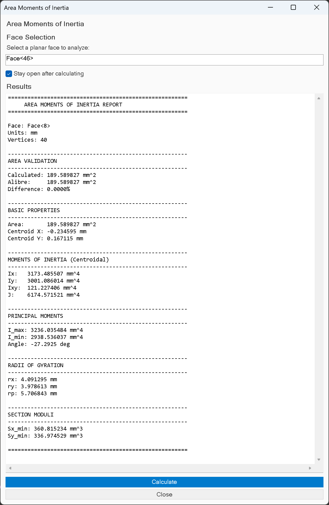

<strong>Repository Details</strong>

# alibre-cross-section-tools-addon

Section properties and area tools addon. 

## Known Uses

- PoC/pre-alpha addon
- calculations needs expert review ( I reviewed the math and it appears to be accurate )
- circular faces aren't working

## Installation

[see releases. ](https://github.com/the-tool-store/alibre-cross-section-tools-addon/releases/tag/PoC%2Fpre-alpha)

### Additional Resources

N/A

## Contribution

Contributions to the codebase are not currently accepted, but questions and comments are welcome.

## Acknowledgment and License

MIT — see license.

## Credit & Citation

[Alibre Forum - Inspiration](https://www.alibre.com/forum/index.php?threads/area-moments-2d-sketch.26377/#post-181950)

